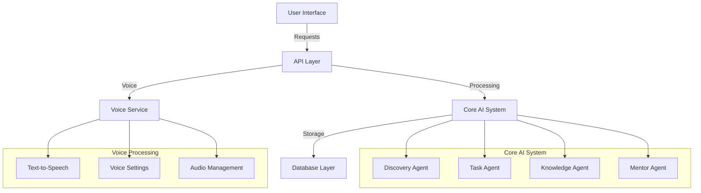

# 🧠 S.A.T.O.R.I. AI


**Awaken Intelligence. Automate Workflows. Empower Creation.**

*An advanced multi-agent AI platform for transformative personal and professional growth.*

[Getting Started](#-getting-started) • [Features](#-features) • [Architecture](#-architecture) • [Documentation](#-documentation) • [Development](#-development)

---

## 🌟 Overview

S.A.T.O.R.I. AI (System for Agentic Tasks, Orchestration, and Real-time Intelligence) is a cutting-edge AI platform that harmonizes advanced technology with human-centric design. By leveraging multiple specialized AI agents, it creates a synergistic environment for personal growth, workflow optimization, and knowledge management.

### 🎯 Key Benefits

- **Personal Growth**: Guide your journey of self-discovery and development
- **Workflow Mastery**: Optimize and automate your professional processes
- **Knowledge Synthesis**: Transform information into actionable insights
- **Strategic Vision**: Develop clear pathways to achieve your goals
- **Voice Interaction**: Natural voice communication with customizable voices

## 🚀 Features

### 🤖 Multi-Agent Orchestration

- Dynamic framework powered by LangGraph and LangChain
- Specialized agents for different domains:
  - 🧘‍♂️ **Discovery Agent**: Personal growth and self-reflection
  - ⚡ **Task Agent**: Workflow optimization and automation
  - 📚 **Knowledge Agent**: Information management and retrieval
  - 🎯 **Mentor Agent**: Strategic guidance and planning

### 🔄 Voice Capabilities

- Text-to-speech synthesis using Eleven Labs
- Multiple voice options with customizable parameters:
  - Voice stability and clarity control
  - Style and emotion adjustment
  - Speaker boost for enhanced quality
- Voice settings persistence
- Audio download and sharing options

### 🔄 Intelligent Processing

- Advanced document understanding and analysis
- Context-aware responses and recommendations
- Real-time learning and adaptation
- Memory management and knowledge retention
- Voice response generation

### 🎨 Multimodal Capabilities

- Text, voice, and visual input processing
- Rich interactive responses
- Dynamic visualization of insights
- Adaptive user interfaces
- Voice output customization

### 📊 Knowledge Management

- Vector-based information storage
- Semantic search and retrieval
- Automated knowledge organization
- Contextual recommendations

## 🏗️ Architecture

### Tech Stack

- **Backend**: FastAPI, LangChain, LangGraph
- **Frontend**: Streamlit (POC phase)
- **Database**: ChromaDB, PostgreSQL with pgvector
- **AI Models**: OpenAI GPT-4, Ada Embeddings
- **Voice**: Eleven Labs API

### System Components



## 🛠️ Getting Started

### Prerequisites

- Python 3.10+
- PostgreSQL 14+ with pgvector extension
- OpenAI API key
- Eleven Labs API key
- Node.js 18+ (for development)

### Environment Setup

1. **Clone the repository**

```bash
git clone https://github.com/yourusername/SATORI-AI.git
cd SATORI-AI
```

1. **Create and activate virtual environment**

```bash
# Windows
python -m venv venv
.\venv\Scripts\activate

# Linux/MacOS
python -m venv venv
source venv/bin/activate
```

1. **Install dependencies**

```bash
pip install -r requirements.txt
```

1. **Configure environment variables**

```bash
cp .env.example .env
# Edit .env with your settings:
# - OPENAI_API_KEY
# - ELEVEN_LABS_API_KEY
# - Other configuration options
```

1. **Initialize database**

```bash
# Install pgvector extension
psql -d your_database -c 'CREATE EXTENSION vector;'

# Run migrations
python scripts/init_db.py
```

### Running the Application

1. **Start the backend server**

```bash
python run.py
# or
uvicorn backend.api.main:app --reload
```

1. **Start the frontend application**

```bash
streamlit run frontend/app.py
```

The application will be available at:
- Frontend: http://localhost:8501
- Backend API: http://localhost:8000
- API Documentation: http://localhost:8000/docs

### Voice Configuration

1. **Access Voice Settings**
   - Open the Voice Settings panel in the UI
   - Select your preferred voice
   - Adjust voice parameters:
     - Stability (0-1)
     - Style (0-1)
     - Similarity Boost (0-1)
     - Speaker Boost (on/off)

2. **Enable Voice Responses**
   - Toggle voice response in chat interface
   - Customize voice per conversation
   - Download or share generated audio

## 📚 Documentation

### User Guides

- [Getting Started Guide](docs/getting_started.md)
- [User Manual](docs/user_manual.md)
- [FAQ](docs/faq.md)

### Developer Documentation

- [API Reference](docs/api_reference.md)
- [Architecture Overview](docs/architecture.md)
- [Development Guide](docs/development.md)
- [Contributing Guidelines](CONTRIBUTING.md)

### API Documentation

- Interactive API documentation is available at `/docs` when running the server
- OpenAPI specification available at `/openapi.json`

## 👩‍💻 Development

### Development Setup

1. **Install development dependencies**

```bash
pip install -r requirements-dev.txt
```

1. **Set up pre-commit hooks**

```bash
pre-commit install
```

1. **Run tests**

```bash
pytest
```

### Code Quality Tools

- **Formatting**: `black .`
- **Linting**: `flake8`
- **Type checking**: `mypy .`
- **Sort imports**: `isort .`

### Branch Strategy

- `main`: Production-ready code
- `develop`: Development branch
- Feature branches: `feature/*`
- Bug fixes: `fix/*`
- Releases: `release/*`

## 🤝 Contributing

We welcome contributions! Please see our [Contributing Guidelines](CONTRIBUTING.md) for details on:

- Code of Conduct
- Development process
- Pull request process
- Coding standards
- Testing requirements

## 🔒 Security

- [Security Policy](SECURITY.md)
- [Vulnerability Reporting](SECURITY.md#reporting)
- [Security Best Practices](docs/security.md)

## 📄 License

This project is licensed under the MIT License - see the [LICENSE](LICENSE) file for details.

## 💖 Acknowledgments

- Built with ❤️ and powered by @hams_ollo
- Inspired by the Zen concept of Satori - sudden enlightenment
- Special thanks to all contributors

---

[Website](https://your-website.com) • [Documentation](docs/) • [Report Bug](issues/) • [Request Feature](issues/) • [Security](SECURITY.md)
